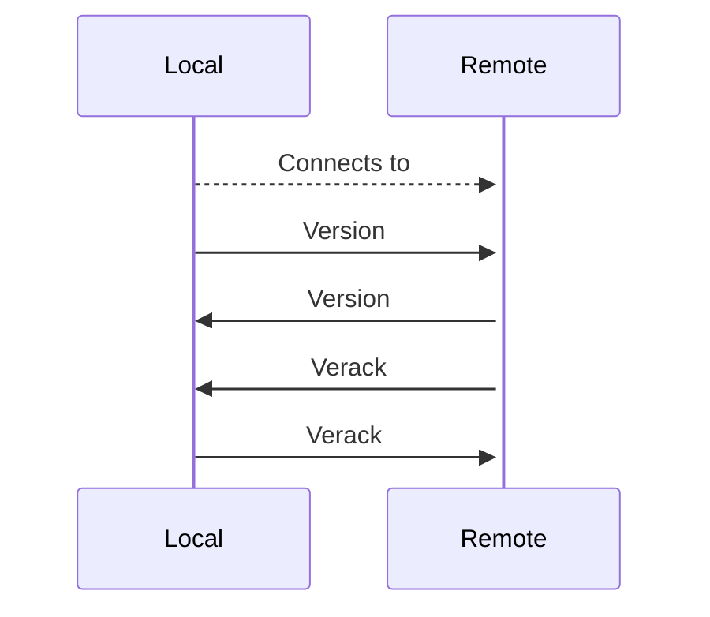

--8<-- "refs.txt"

# Network Protocol

The Bitcoin network protocol is a TCP protocol that serializes messages starting from a special 4 bytes constant data called *Magic bytes*, followed by 12 bytes representing the *command name*, 4 bytes representing the *payload size* and 4 bytes with the checksum of the payload.
More specific information about bitcoin protocol [can be found here.](https://developer.bitcoin.org/reference/p2p_networking.html){:target="_blank"} 

Mithril Shards implements a low level stack of interfaces and implementations that allow to focus on the application logic instead on low level details.
A default implementation uses Bedrock Framework to leverage the low level communication between peers and this is what's used in the Bitcoin shard to provide P2P connectivity.

A typical Bitcoin full node (henceforth called *FN*) is able to connect to other nodes and accept incoming connections.
Before two peers can exchange information, they have to perform an handshake to prove that they can understand each other (more details on the the bitcoin network protocol can be found on this [bitcoin developer resource](https://developer.bitcoin.org/devguide/p2p_network.html){:target="_blank"}).

Before being able to handshake, whenever a connection has been established between two peers the FN stores some metadata about the remote peer. This data is stored into a class that implements IPeerContext interface and its implementation represents our next section.


## Peer Context

Default Mithril Shards implementation uses `PeerContext` class to store, among other things, information like peer unique identification, direction (inbound/outbound) remote and local endpoints, user agent identification, negotiated protocol version and other attachable properties leveraging the .Net [IFeatureCollection](https://docs.microsoft.com/en-us/dotnet/api/microsoft.aspnetcore.http.features.ifeaturecollection?view=aspnetcore-5.0){:target="_blank"} interface.

Bitcoin needs some additional information and some of the properties that are ubiquitous needed among all optional Bitcoin features (shards) like wallet, APIs, indexer, etc... have been defined directly into `BitcoinPeerContext` that extends the default `PeerContext`. Some of the additional properties are Permissions (that may change the FN behavior based on its set) and TimeOffset, that's an important aspect for the consensus logic.

Another important property exposed by peer context is the `ConnectionCancellationTokenSource` property, that's a CancellationTokenSource that can be used to trigger the disconnection from a peer. It's internally used to know when the connection has been closed, to stop the execution of async methods that rely on an active connection to a remote peer.

As per `IPeerContext` interface, `ConnectionCancellationTokenSource` can only be read so it's important that custom implementation of `IPeerContext` don't change it's value out of constructor.
This property is actively used within message processors (more about it in a later section).

The cancellation of `ConnectionCancellationTokenSource` shouldn't be canceled directly, to force a peer disconnection an event of type `PeerDisconnectionRequired` has to be published on the event bus, but for simplicity `BitcoinPeerContext` implements a `Disconnect` method that does that. So anytime you have a need to disconnect a peer, just call `thePeerContext.Disconnect("My Disconnection reason!")`.
You can find already usage of it in message processor classes.

The peer context creation is handled by the core Mithril Shard network implementation and since it can't know about the `BitcoinPeerContext` properties, it relies on a peer context factory, in this case we are talking about `BitcoinPeerContextFactory` class.

It leverages the generic class `PeerContextFactory<>` and its implementation is bare bone, no need to override anything.

```c#
public class PeerContextFactory<TPeerContext> : IPeerContextFactory where TPeerContext : IPeerContext
```


## Accepting a connection

Once the peer context has been created, a sanity check is performed to see if the two peers can connect to each other before trying to handshake and the behavior is very similar to both inbound and outbound connections.

The only difference is that actually for outgoing connection the check is done before trying to connect but very likely it would be done as per incoming connection soon.

What happens when an incoming connection has been accepted is that the connection has to pass all registered (in the DI containers) implementations of `IServerPeerConnectionGuard` interface.


### `ServerPeerConnectionGuardBase` 

In Bitcoin shard all guard rules are extending `ServerPeerConnectionGuardBase` implementation that's a simple class:

```c#
public abstract class ServerPeerConnectionGuardBase : IServerPeerConnectionGuard
   {
      protected readonly ILogger logger;
      protected readonly ForgeConnectivitySettings settings;

      public ServerPeerConnectionGuardBase(ILogger logger, IOptions<ForgeConnectivitySettings> options)
      {
         this.logger = logger;
         settings = options.Value;
      }

      public ServerPeerConnectionGuardResult Check(IPeerContext peerContext)
      {
         string? denyReason = TryGetDenyReason(peerContext);
         if (!string.IsNullOrEmpty(denyReason))
         {
            logger.LogDebug("Peer connection guard not passed: {denyReason}", denyReason);
            return ServerPeerConnectionGuardResult.Deny(denyReason);
         }

         return ServerPeerConnectionGuardResult.Allow();
      }

      internal abstract string? TryGetDenyReason(IPeerContext peerContext);
   }
```

This class implements the plumbing code required to run (and log in case of rule check not passed) the guard rule, so a guard rule implementation has just to focus on its guarding logic.
A simple example is the `MaxConnectionThresholdGuard` rule that ensure that an incoming transaction doesn't exceed the maximum allowed number of inbound connections:

```c# hl_lines="12-20"
public class MaxConnectionThresholdGuard : ServerPeerConnectionGuardBase
   {
      readonly IConnectivityPeerStats _peerStats;

      public MaxConnectionThresholdGuard(ILogger<MaxConnectionThresholdGuard> logger,
                                         IOptions<ForgeConnectivitySettings> settings,
                                         IConnectivityPeerStats serverPeerStats) : base(logger, settings)
      {
         _peerStats = serverPeerStats;
      }

      internal override string? TryGetDenyReason(IPeerContext peerContext)
      {
         if (_peerStats.ConnectedInboundPeersCount >= settings.MaxInboundConnections)
         {
            return "Inbound connection refused: max connection threshold reached.";
         }

         return null;
      }
   }
```

In order to be used during connection check, these guard classes have to be registered in the DI container.
`MaxConnectionThresholdGuard` for example is registered into the extension that register the bitcoin shard by using

```
services.AddSingleton<IServerPeerConnectionGuard, InitialBlockDownloadStateGuard>()
```

This allow the flexibility of having custom guard rule simply by implementing a rule and register in the DI container, any required service will be injected automatically; of course if it relies on a custom service not already available in my implementation, that service has to be registered too.

!!! info
	These classes have to be registered as singleton and therefor must be stateless

Network protocol is implemented through the serialization of classes which implement `INetworkMessage` interface and are decorated with `NetworkMessageAttribute` that works in synergy with an implementation of `INetworkMessageSerializer` to implement network serialization.

## Handshake

Once a connection has been accepted between two nodes, they start exchanging messages in order to handshake and prove each other they are two compatible nodes that can exchange informations.

!!! info
	Bitcoin protocol doesn't punish nodes that send unknown messages. I think however that a node has to monitor its connected peer activities and punish them if they send too many unknown messages causing our node to waste resources.

Without going too deeper into bitcoin handshake process, the exchanges messages are summarized by this sequence diagram:



!!! info
	Bitcoin protocol doesn't define a specific order for the `Remote` node to send its `Verack` and `Version` message so `Local` node has to account that and accept these messages in any order.
