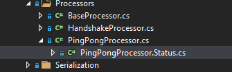

--8<-- "refs.txt"

MithrilShards.Example project represents the core project where most of the fundamental example application classes lies.

Most of the custom application code is implemented here:

* network classes like
  * a custom IPeerContext implementation and its factory class
  * some custom `IServerPeerConnectionGuard` implementation to filter incoming connections and a custom ConnectorBase implementation that contains the logic to connect to other peers

* protocol classes like
  * `INetworkMessage` implementations of custom messages (payloads) and complex types used within their implementation.
  * `INetworkMessage` and type serializators that serialize classes into a byte representation that can be sent through the network.
  * `INetworkMessage` processors that contain the logic to parse incoming messages and send messages to other peers
  * classes like shard class and its setting class that forms the plumbing of our application.
  * custom services used by processors or other internal components like `QuoteService`.


## Main classes

In the following sections we are going to dissect the project to expose and study the main classes implemented in the project.

### ExampleShard

This class represents the core Example Shard, actually it doesn't contains any code but you could extend this example to start for example an async task when the shard starts (`StartAsync` method) and stop it when it stops (`StopAsync` method).

Note that a shard StartAsync is implicitly called when the forge implementation starts, see [DefaultForge] for more information.

### ExampleSettings

Holds configuration settings for the ExampleShard.  
You can declare everything may be useful to customize the behavior of the shard by configuration, in this simple example we have few properties

```c#
public class ExampleSettings : MithrilShardSettingsBase
{
   const long DEFAULT_MAX_TIME_ADJUSTMENT = 70 * 60;

   public long MaxTimeAdjustment { get; set; } = DEFAULT_MAX_TIME_ADJUSTMENT;

   public List<ExampleClientPeerBinding> Connections { get; } = new List<ExampleClientPeerBinding>();
}
```

`Connections` parameter is a list of ExampleClientPeerBinding instances that has been added to show how to define and use complex classes within a configuration settings class.

```c#
/// <summary>
/// Client Peer endpoint the node would like to be connected to.
/// </summary>
public class ExampleClientPeerBinding
{
   /// <summary>IP address and port number of the peer we wants to connect to.</summary>
   [IPEndPointValidator]
   [Required]
   public string? EndPoint { get; set; }

   public string? AdditionalInformation { get; set; }

   public bool TryGetExampleEndPoint([MaybeNullWhen(false)] out ExampleEndPoint endPoint)
   {
      endPoint = null;

      if (!IPEndPoint.TryParse(EndPoint ?? string.Empty, out IPEndPoint? ipEndPoint))
      {
         return false;
      }

      if (AdditionalInformation == null)
      {
         return false;
      }

      endPoint = new ExampleEndPoint(ipEndPoint.Address, ipEndPoint.Port, AdditionalInformation);
      return true;
   }
}
```

#### Validating settings

ExampleClientPeerBinding class has an EndPoint property that represents the endpoint (IP:Address) of a remote node we'd like to connect to and it's decorated with attributes that are used to validate the configuration during the initialization of the forge.

Validation of the settings make use of [System.ComponentModel.DataAnnotations](https://docs.microsoft.com/en-us/dotnet/api/system.componentmodel.dataannotations?view=net-5.0){:target="_blank"} and [RequiredAttribute](https://docs.microsoft.com/en-us/dotnet/api/system.componentmodel.dataannotations.requiredattribute?view=net-5.0){:target="_blank"} used in the example is one of those attribute that belongs to standard set.  
A different story is [IPEndPointValidator]:

```c#
/// <summary>
/// Ensure the value is a valid IPEndPoint.
/// Null value is considered valid, use <see cref="RequiredAttribute"/> if you don't want to allow null values.
/// </summary>
/// <seealso cref="System.ComponentModel.DataAnnotations.ValidationAttribute" />
[AttributeUsage(AttributeTargets.Field | AttributeTargets.Property, AllowMultiple = false, Inherited = true)]
public class IPEndPointValidator : ValidationAttribute
{
   protected override ValidationResult? IsValid(object? value, ValidationContext validationContext)
   {
      if (value is null) return ValidationResult.Success;

      string instance = value as string ?? string.Empty;

      if (!IPEndPoint.TryParse(instance, out IPEndPoint? _))
      {
         return new ValidationResult($"Not a valid EndPoint ({instance})", new string[] { validationContext.MemberName! });
      }

      return ValidationResult.Success;
   }
}
```

This is a concrete example about how to perform validation for custom settings when default validation attributes aren't enough.

!!! tip
	Validating settings is important because would stop the node during the forge build process if some settings aren't properly configured, for example if the settings file is malformed or instead of an expected endpoint like in this case, the user specify an incorrect endpoint string. Having a sanity check during validation, allows you to write simpler code when you make use of the setting file, because you can be assured that the values are correct.

#### Configuration file

To populate ExampleSettings file by using a json configuration file, we have to add `Example` section in your application configuration file

```json
"Example": {
   "MaxTimeAdjustment": 4200,
   "Connections": [
      {
         "Endpoint": "127.0.0.1:45061",
         "AdditionalInformation": "I'm cool!"
      }
   ]
}
```

!!! important
	By inheriting a setting class from [MithrilShardSettingsBase], the section name to specify in the json file is the name of the setting class without the suffix "*Settings*". ExampleSettings becomes then Example. You can override this behavior by overriding ConfigurationSection property in your settings file.


### IQuoteService

This interface (and its QuoteService implementation) is an example of a service used within the example application to provide a random quote to send as a message to our pong reply.

It's definition is purposely simple:

```c#
public interface IQuoteService
{
   List<string> Quotes { get; }

   string GetRandomQuote();
}
```

!!! warning
	In a proper application you wouldn't want to expose directly a list of quotes but rather expose methods like GetQuotes, AddQuote, RemoveQuote, anyway this example goal is to showcase Mithril Shards library and not to teach about how properly write your services classes.

QuoteService implementation simply initialize a list of quotes (from [The Lord of the Rings](https://en.wikipedia.org/wiki/The_Lord_of_the_Rings_(film_series)){:target="_blank"} movies and books!), exposes the resulting list as a property that can be updated and a method GetRandomQuote to return a random quote from the available quotes.

!!! tip
	As a further excercise you could try to implement a persistence layer for QuoteService, or a complete different implementation and then replace default QuoteService registration with your own!


### ServerPeerConnectionGuardBase

This class implements the interface [IServerPeerConnectionGuard] whose purpose is to validate an incoming connection before we attempt to handshake and exchange information with it.  
It's an abstract class and its purpose is to implement generic useful code to be used by concrete peer guard implementations in such a way that guard implementation has just to focus on the guarding rule.
Currently the example implements two guards: 

`MaxConnectionThresholdGuard` 
:	makes use of ForgeConnectivitySettings to ensure that the number of incoming transaction doesn't exceeds the `MaxInboundConnections` settings value.

`BannedPeerGuard`
:	ensures that the connecting node isn't flagged as banned in our IPeerAddressBook.
Actually it's not honored because the default IPeerAddressBook implementation (`DefaultPeerAddressBook`) is a fake implementation that just log messages but does nothing.

As a reference, this is the MaxConnectionThresholdGuard implementation:

```c#
public class MaxConnectionThresholdGuard : ServerPeerConnectionGuardBase
{
   readonly IConnectivityPeerStats _peerStats;

   public MaxConnectionThresholdGuard(ILogger<MaxConnectionThresholdGuard> logger,
                                       IOptions<ForgeConnectivitySettings> settings,
                                       IConnectivityPeerStats serverPeerStats) : base(logger, settings)
   {
      _peerStats = serverPeerStats;
   }

   internal override string? TryGetDenyReason(IPeerContext peerContext)
   {
      if (_peerStats.ConnectedInboundPeersCount >= settings.MaxInboundConnections)
      {
         return "Inbound connection refused: max connection threshold reached.";
      }

      return null;
   }
}
```


### ExampleRequiredConnection

This class implements [IConnector], extending `ConnectorBase` abstract class.  
A RequiredConnection connector is already implemented and added by default when we build a forge, this example shows how you can override default registered services with a custom implementation: ExampleRequiredConnection is meant to replace RequiredConnection.

By default, to instruct our node to try to connect to specific remote nodes, we can specify these endpoints in `ForgeConnectivitySettings Connections` property and the RequiredConnection connector will attempt to connect to the specified nodes automatically but since we have our custom list of remote endpoints defined in our ExampleSettings Connections property, we want to use that list instead.

!!! info
	Check `ReplaceServices` method in ForgeBuilderExtensions.cs class to see how service replacement is performed.


## Protocol Messages

Of course in a P2P example application we have to talk with other peers, so we need messages to exchange!  
In this example we implemented four messages: two for the handshake process (borrowed by bitcoin protocol), namely `VerackMessage` and `VersionMessage` and two to implement the ping pong logic: `PingMessage` and `PongMessage`.

Let's just examine one of them and lets pick the one that contains a `complex type` that has to be serialized over the network.

### PongMessage

```c#
[NetworkMessage(COMMAND)]
public sealed class PongMessage : INetworkMessage
{
   private const string COMMAND = "pong";
   string INetworkMessage.Command => COMMAND;

   public PongFancyResponse? PongFancyResponse { get; set; }
}
```

A message has to implement [INetworkMessage] interface and be decorated with the [NetworkMessageAttribute] in order to be serialized by the [NetworkMessageSerializerManager].

Since the message name, exposed by the `Command` property, is used both as the return value of the property and as the parameter passed to the NetworkMessageAttribute, a private const string is used to prevent manual errors when creating a new message: just edit the message name in one place.

The PongMessage payload just contains one serialized property, PongFancyResponse, and the PongMessageSerializer will show how to serialize this complex type.

#### PongFancyResponse

This type represent a complex type that is serialized when we send a PongMessage to a peer. We could have added the property that this type contains, straight into the PongMessage class but since this example project has the goal to showcase Mithril Shards features, having a complex type is useful to describe the process needed to handle such scenarios.

The class itself is a simple POCO class (it's POCO by choice but it's not mandatory to be so, you can use any kind of class, as long as you implement a serializer for that specific type)

```c#
public class PongFancyResponse
{
   /// <summary>
   /// The nonce received from the ping request.
   /// </summary>
   public ulong Nonce { get; set; }

   public string? Quote { get; set; }
}
```

Nonce is a simple unsigned long value that's used to link a pong response to a ping request, just returning back the ping Nonce value, while Quote is a nullable string that contains the Quote generated by the node sending the PongMessage.

!!! note
	Projects within Mithril Shards solution make use of [nullable references types](https://docs.microsoft.com/en-us/dotnet/csharp/nullable-references){:target="_blank"} and proper `.editorconfig` configuration to raise warning and exceptions in multiple scenarios and proudly have a 0 warning build (most of the time :nerd_face:).


## Protocol Messages Serializers

Like for messages, their serializer has to implement an interface, in this case to follow DRY, a base generic class `ExampleNetworkMessageSerializerBase<TMessage>` is implemented that acts just as placeholder because it contains no code except an empty method and some comments, that explain how doing so you can expand a serializer by having a custom [IPeerContext] like in this example and some helper methods you may find useful in your implementation.

Usually you have one message serializer for each message you have, so in this case we have four message serializers: VersionMessageSerializer, VerackMessageSerializer, PingMessageSerializer and PongMessageSerializer.


### PongMessageSerializer

Since we have already described the PongMessage in details, makes sense to explain its serializer:

```c#
/// <summary>
/// PongMessage serializer, used to serialize and send through the network a <see cref="PongMessage"/>
/// </summary>
/// <seealso cref="ExampleNetworkMessageSerializerBase{PongMessage}" />
public class PongMessageSerializer : ExampleNetworkMessageSerializerBase<PongMessage>
{
   readonly IProtocolTypeSerializer<PongFancyResponse> _pongFancyResponseSerializator;

   public PongMessageSerializer(IProtocolTypeSerializer<PongFancyResponse> pongFancyResponseSerializator)
   {
      /// since the pong message has a complex type that can be reused in other payload (well,
      /// this is specific to pong but you get the idea) we are implementing a custom
      /// type serializer and inject it into this message serializer
      _pongFancyResponseSerializator = pongFancyResponseSerializator;
   }

   public override void Serialize(PongMessage message, int protocolVersion, ExamplePeerContext peerContext, IBufferWriter<byte> output)
   {
      output.WriteWithSerializer(message.PongFancyResponse!, protocolVersion, _pongFancyResponseSerializator);
   }

   public override PongMessage Deserialize(ref SequenceReader<byte> reader, int protocolVersion, ExamplePeerContext peerContext)
   {
      return new PongMessage
      {
         PongFancyResponse = reader.ReadWithSerializer(protocolVersion, _pongFancyResponseSerializator)
      };
   }
}
```

What to highlight in this code is: 

- [ ] PongMessageSerializer declares it's a serializer for the PongMessage by extending `ExampleNetworkMessageSerializerBase<PongMessage>` (note that the generic type argument is PongMessage)
- [ ] It's constructor accepts a `IProtocolTypeSerializer<PongFancyResponse> pongFancyResponseSerializator`, this will be injected automatically by the DI container when the serializer is resolved and it will be used to serialize the complex type PongFancyResponse.  
  Later we'll see the PongFancyResponseSerializer that will be used, note how actually we ask for a IProtocolTypeSerializer<PongFancyResponse> and at runtime our serializer PongFancyResponseSerializer will be used, no need to worry about knowing the real implementation of our serializer, we can even change it at runtime or using a custom feature that changes serializers, that's the power of **abstraction**!
- [ ] We have to implement Serialize and Deserialize methods and in this example we are just relying on the extension `WriteWithSerializer` and `ReadWithSerializer`, nothing easier than that.  
  If we had other primitive types to serialize, like an integer property, we had just to use the proper `IBufferWriter<byte>` primitive extension WriteInt (to serialize) and `SequenceReader<byte>` ReadInt primitive extension (to read).


!!! info
	You are encouraged to check source code: IBufferWriterExtensions.cs and SequenceReaderExtensions.cs classes contains all the primitive extensions to serialize primitive types and helper to leverage the use of IProtocolTypeSerializer used to serialize complex types.


### Protocol Types Serializers

When a message contains a complex type like our PongFancyResponse type, we can make use of `IProtocolTypeSerializer` implementations.

In our example we have the PongFancryResponseSerializer class that we can study

```c#
public class PongFancyResponseSerializer : IProtocolTypeSerializer<PongFancyResponse>
{
   public int Serialize(PongFancyResponse typeInstance, int protocolVersion, IBufferWriter<byte> writer, ProtocolTypeSerializerOptions? options = null)
   {

      int size = 0;
      size += writer.WriteULong(typeInstance.Nonce);
      size += writer.WriteVarString(typeInstance.Quote);

      return size;
   }

   public PongFancyResponse Deserialize(ref SequenceReader<byte> reader, int protocolVersion, ProtocolTypeSerializerOptions? options = null)
   {
      return new PongFancyResponse
      {
         Nonce = reader.ReadULong(),
         Quote = reader.ReadVarString()
      };
   }
}
```

The logic is similar to message serializer, we have to implement the interface `IProtocolTypeSerializer<TComplextype>` that requires us to implement the Serialize and Deserialize method.

In this specific example we can see how an unsigned long and a nullable string are serialized in our protocol implementaiton.

!!! tip
	IProtocolTypeSerializer implementations can inject other IProtocolTypeSerializer implementations if they include other complex types.


## Processors

Processors are fundamental classes that allow us to react to incoming messages.
Mithril Shards has a clever way to handle messages: whenever a stream of data arrives, it gets read to see if it represents a known messages and if it's the case, all the processors that are registered as interested in that particular message are activated.

Technically it's like a publish-subscribe pattern but it's transparent for the developer, everything it's handled by following conventions and implementing specific classes.

Processors are attached to a peer context by the Mithril Shards core class NetworkMessageProcessorFactory, their lifetime scope is defined as Transient, this mean that each peer context has its own processor instance attached (processors aren't mean to natively share data between peers but you can anyway create a singleton service that inject in the processor to do so).

In our example, an abstract `BaseProcessor` class implements the code to deal with common needs, it has a lot of helper methods that allow you to subscribe and unsubscribe to event bus messages, react to peer handshake, send messages, execute conditional statement asynchronously and much more (check out the BaseProcess.cs file).

Processors can be quite complex, in this example PingPongProcessor is quite simple but still contains useful snippets that you can learn and use.


### PingPongProcessor

To shed some light on this, let's inspect the PingPongProcessor, whose goal is to process incoming ping requests and reply with pong messages, or generate ping messages after a certain period of time that has elapsed (it's not meant to be an optimized protocol, in such case you'd want to ping only if you don't receive data from the peer for a certain time, but the goal is to keep the example simple in logic but exhaustive as implementation).

#### Declaration

This time I'm not including the full class source code but just meaningful snippets, let's start from the declaration:

```c#
public partial class PingPongProcessor : BaseProcessor,
   INetworkMessageHandler<PingMessage>,
   INetworkMessageHandler<PongMessage>
```

PingPongProcessor inherits from BaseProcessor and is declared as a partial class, because its internal status is declared as an inner class and defined into a nested file PingProcessor.Status.cs.  
This allow us to restrict Status scope while keeping our source more compact.

  
<sup>In visual studio the inner file is shown as a child of the PingProngProcessor.cs as you can see.</sup>

It also implements two interfaces: `INetworkMessageHandler<PingMessage>` and `INetworkMessageHandler<PongMessage>`.
Implementing INetworkMessageHandler generic interface is a way to instruct the Mithril Shards framework that this processor is interested in handling incoming PingMessage and PongMessage.

Declarative syntax like this allow us to maintain better our code when we have several processors and allow us to have a better control over which process elaborates which messages without much effort.

#### Constructor

```c#
public PingPongProcessor(ILogger<PingPongProcessor> logger,
                           IEventBus eventBus,
                           IPeerBehaviorManager peerBehaviorManager,
                           IRandomNumberGenerator randomNumberGenerator,
                           IDateTimeProvider dateTimeProvider,
                           IPeriodicWork periodicPing,
                           IQuoteService quoteService)
   : base(logger, eventBus, peerBehaviorManager, isHandshakeAware: true, receiveMessagesOnlyIfHandshaked: true)
{
   _randomNumberGenerator = randomNumberGenerator;
   _dateTimeProvider = dateTimeProvider;
   _periodicPing = periodicPing;
   _quoteService = quoteService;
}
```

The constructor declares which services we need and calls the base constructor passing its needed services.
I'd emphasize the last 2 base constructor parameter that I've specified by using named arguments to better show their meaning: `isHandshakeAware: true, receiveMessagesOnlyIfHandshaked: true`

Specifying true to isHandshakeAware means that the processor is handshake aware and when our peer handshake correctly with a remote peer, `OnPeerHandshakedAsync` method is invoked.  
In our example we uses this information to start a periodic task that ensures that we send a ping request every PING_INTERVAL amount of time

```c#
protected override ValueTask OnPeerHandshakedAsync()
{
   _ = _periodicPing.StartAsync(
         label: $"{nameof(_periodicPing)}-{PeerContext.PeerId}",
         work: PingAsync,
         interval: TimeSpan.FromSeconds(PING_INTERVAL),
         cancellation: PeerContext.ConnectionCancellationTokenSource.Token
      );

   return default;
}

private async Task PingAsync(CancellationToken cancellationToken)
{
   var ping = new PingMessage();
   ping.Nonce = _randomNumberGenerator.GetUint64();

   await SendMessageAsync(ping).ConfigureAwait(false);

   _status.PingSent(_dateTimeProvider.GetTimeMicros(), ping);
   logger.LogDebug("Sent ping request with nonce {PingNonce}", _status.PingRequestNonce);

   //in case of memory leak, investigate this.
   _pingCancellationTokenSource = CancellationTokenSource.CreateLinkedTokenSource(cancellationToken);

   // ensures the handshake is performed timely
   await DisconnectIfAsync(() =>
   {
      return new ValueTask<bool>(_status.PingResponseTime == 0);
   }, TimeSpan.FromSeconds(TIMEOUT_INTERVAL), "Pong not received in time", _pingCancellationTokenSource.Token).ConfigureAwait(false);
}
```

The call to `DisconnectIfAsync` within PingAsync method, ensures that if the other peers doesn't reply to us with a proper pong messages, we disconnect from the remote peer.  
The action passed to DisconnectIfAsync gets evaluated when the time specified by `TimeSpan.FromSeconds(TIMEOUT_INTERVAL)` elapses.  
Current status of our processor is held in the inner Status class, when we call its PingSent we are resetting the PingResponseTime to 0.  
When we receive a pong message PingResponseTime  is set to a value and thus when the timeout elapses we are expected to find a value if the peer replied, or 0 if it didn't (and thus disconnect the peer).

!!! warning
	This logic to works requires that TIMEOUT_INTERVAL is lower than PING_INTERVAL.


#### Handling the PingMessage

As we saw earlier, we declared that the class was implementing INetworkMessageHandler<PingMessage>, this mean that we have to implement its ProcessMessageAsync where we can put our logic to handle the ping message:

```c#
async ValueTask<bool> INetworkMessageHandler<PingMessage>.ProcessMessageAsync(PingMessage message, CancellationToken cancellation)
{
   await SendMessageAsync(new PongMessage
   {
      PongFancyResponse = new PongFancyResponse
      {
         Nonce = message.Nonce,
         Quote = _quoteService.GetRandomQuote()
      }
   }).ConfigureAwait(false);

   return true;
}
```

This method is pretty simple, it just sends an async PongMessage, returning the original ping Nonce and a random quote picked from the IQuoteService implementation.

!!! note
	In this example, ProcessMessageAsync has been implemented as an [explicit implementation of the interface](https://docs.microsoft.com/en-us/dotnet/csharp/programming-guide/interfaces/explicit-interface-implementation){:target="_blank"}, this allows us to hide these methods from the publicly available methods of the type.


#### Handling the PongMessage

Similarly to the PingMessage handler, we implements PongMessage:

```c#
ValueTask<bool> INetworkMessageHandler<PongMessage>.ProcessMessageAsync(PongMessage message, CancellationToken cancellation)
{
   if (_status.PingRequestNonce != 0 && message.PongFancyResponse?.Nonce == _status.PingRequestNonce)
   {
      (ulong Nonce, long RoundTrip) = _status.PongReceived(_dateTimeProvider.GetTimeMicros());
      logger.LogDebug("Received pong with nonce {PingNonce} in {PingRoundTrip} usec. {Quote}", Nonce, RoundTrip, message.PongFancyResponse.Quote);
      _pingCancellationTokenSource.Cancel();
   }
   else
   {
      logger.LogDebug("Received pong with wrong nonce: {PingNonce}", _status.PingRequestNonce);
   }

   return new ValueTask<bool>(true);
}
```

In this method we check that the returned Nonce is the same of our last ping request, if so we update our internal status to signal that we received the pong message.


## Add the shard into the forge

To add the shard to the forge, the [IForgeBuilder] extension `UseExample` in ForgeBuilderExtensions class has to be used, here what it does:

```c#
/// <summary>
/// Inject the Example shard.
/// </summary>
/// <param name="forgeBuilder">The forge builder.</param>
/// <param name="minimumSupportedVersion">The minimum version local nodes requires in order to connect to other peers.</param>
/// <param name="currentVersion">The current version local peer aim to use with connected peers.</param>
/// <returns></returns>
public static IForgeBuilder UseExample(this IForgeBuilder forgeBuilder, int minimumSupportedVersion, int currentVersion)
{
   if (forgeBuilder is null) throw new ArgumentNullException(nameof(forgeBuilder));

   forgeBuilder.AddShard<ExampleShard, ExampleSettings>(
      (hostBuildContext, services) =>
      {
         services
            .AddSingleton(new NodeImplementation(minimumSupportedVersion, currentVersion))
            .AddSingleton<IDateTimeProvider, DateTimeProvider>()
            .AddSingleton<IQuoteService, QuoteService>()
            .AddPeerGuards()
            .AddMessageSerializers()
            .AddProtocolTypeSerializers()
            .AddMessageProcessors()
            .ReplaceServices();
      });

   return forgeBuilder;
}
```

As you can see it makes use of AddShard method to register the [ExampleShard](#exampleshard) and specify its settings ([ExampleSettings](#examplesettings)).

AddShards exposes an action where you can leverage to register custom services, like in this case IDateTimeProvider, IQuoteService and a lot more.  
This is a very important aspect because allows you

!!! tip
	While it's possible to add all service within the AddShard action parameter, I encourage you to split registrations based on their scope and responsibility, like in the example above, it allows you to have a better code base that's easier to manage. 


You can check the ForgeBuilderExtensions.cs file in MithrilShards.Example project to see all services registered, for example AddPeerGuards is a method in the same file that adds some [IServerPeerConnectionGuard]).  
AddMessageSerializers and AddProtocolTypeSerializers are two interesting methods that use reflection to automatically register all [INetworkMessageSerializer] and [IProtocolTypeSerializer] defined in this class without having to manually register each one.