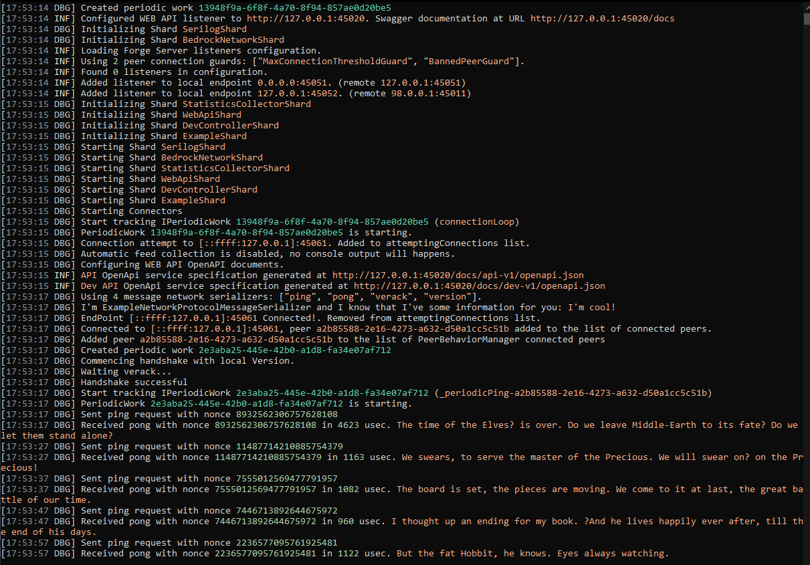
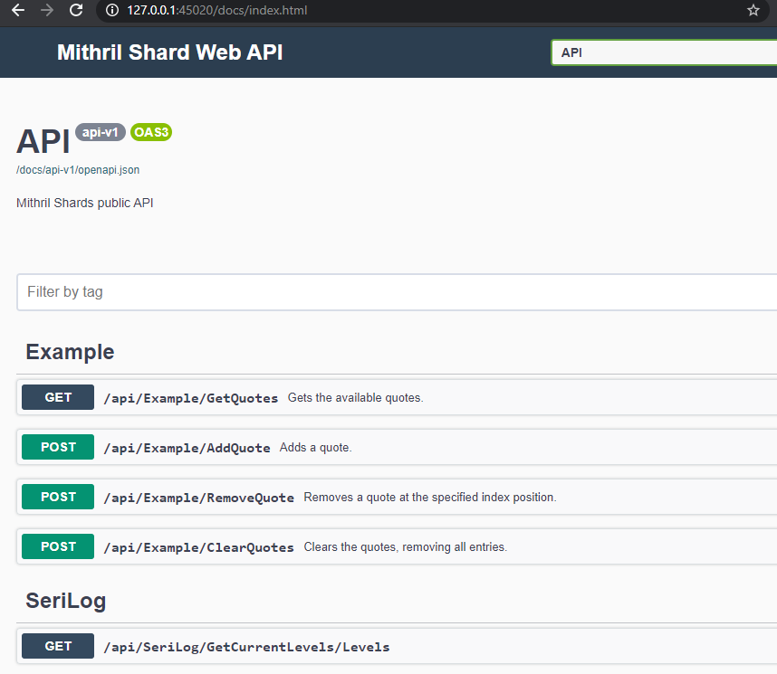
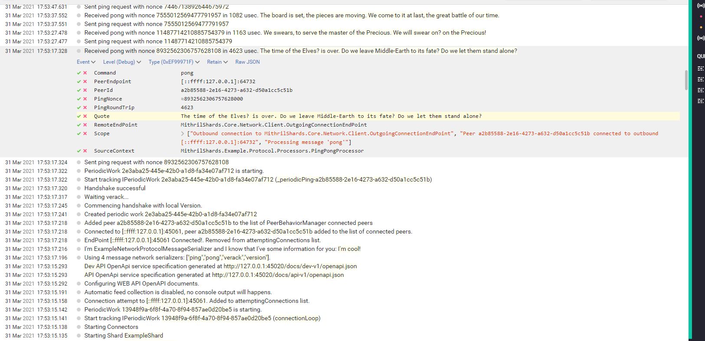

--8<-- "refs.txt"

## Running the example

Running just an instance doesn't fully show you how the program behave, it needs at least 2 peers to connect to each other, that's why there are already multiple configuration files configured differently to let you connect two instances together.

You can run one instance by setting `MithrilShards.Example.Node` as the startup project and run the launchSettings profile "node1" .

Then open a shell at the MithrilShards.Example.Node project path and run the command below

```sh
dotnet run --no-build --settings forge-settings2.json
```

This would cause you to have a debuggable instance running with the configuration defined in `forge-settings.json` file and another run running on the `forge-settings2.json` configuration.

Alternatively you can run both instances, without a debugger (but you can attach later the process to Visual Studio) by running on two different shells:

```sh
dotnet run --no-build --settings forge-settings.json
dotnet run --no-build --settings forge-settings2.json
```

The program running forge-settings.json contains the most verbose log level and you'll have the best experience if you install (or use a docker image) of [Seq](https://datalust.co/seq){:target="_blank"} configured on the port specified in your configuration file (e.g. localhost:5341).  
See [SerilogShard] for more details.

Here an example of the configuration file (forge-settings.json)

```json
{
   "ForgeConnectivity": {
      "ForceShutdownAfter": 300,
      "MaxInboundConnections": 25,
      "AllowLoopbackConnection": false,
      "Listeners": [
         {
            "IsWhitelistingEndpoint": true,
            "Endpoint": "0.0.0.0:45051"
         },
         {
            "IsWhitelistingEndpoint": true,
            "Endpoint": "127.0.0.1:45052",
            "PublicEndpoint": "98.0.0.1:45011"
         }
      ]
   },
   "Example": {
      "MaxTimeAdjustment": 4200,
      "Connections": [
         {
            "Endpoint": "127.0.0.1:45061",
            "AdditionalInformation": "I'm cool!"
         }
      ]
   },
   "StatisticsCollector": {
      "ContinuousConsoleDisplay": false,
      "ContinuousConsoleDisplayRate": 5
   },
   "DevController": {
      "Enabled": true
   },
   "WebApi": {
      "EndPoint": "127.0.0.1:45020",
      "Enabled": true,
      "Https": false
   },

   "Serilog": {
      "Using": [ "Serilog.Sinks.Console", "Serilog.Sinks.Seq" ],
      "Enrich": [ "FromLogContext", "WithMachineName", "WithThreadId" ],
      "WriteTo": [
         {
            "Name": "Console",
            "Args": {
               "IncludeScopes": true,
               "theme": "Serilog.Sinks.SystemConsole.Themes.AnsiConsoleTheme::Code, Serilog.Sinks.Console"
            }
         },
         {
            "Name": "Seq",
            "Args": { "serverUrl": "http://localhost:5341" }
         }
      ],
      "MinimumLevel": {
         "Default": "Debug",
         "Override": {
            "Bedrock.Framework": "Warning",
            "Microsoft": "Warning",
            "System": "Warning"
         }
      }
   }
}
```


### Some Screenshots

Here a screenshot that shows the content of the shell when running the node with settings = `forge-settings.json`

{.zoom}

You can access the Swagger UI by opening the address https://127.0.0.1:45020/docs/index.html  
{.zoom}

Here you can manipulate quotes using the Web API, or even manually attempt to connect to other peers using PeerManagement Connect action in the DEV area.

If you installed Seq, you can access the logs in a better way like shown here:  
{.zoom}