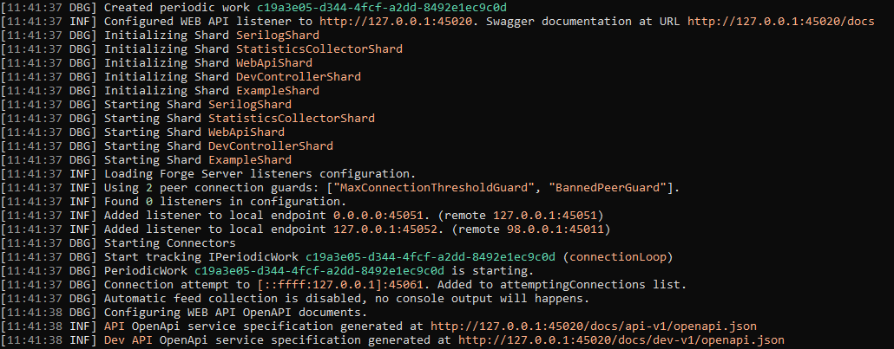
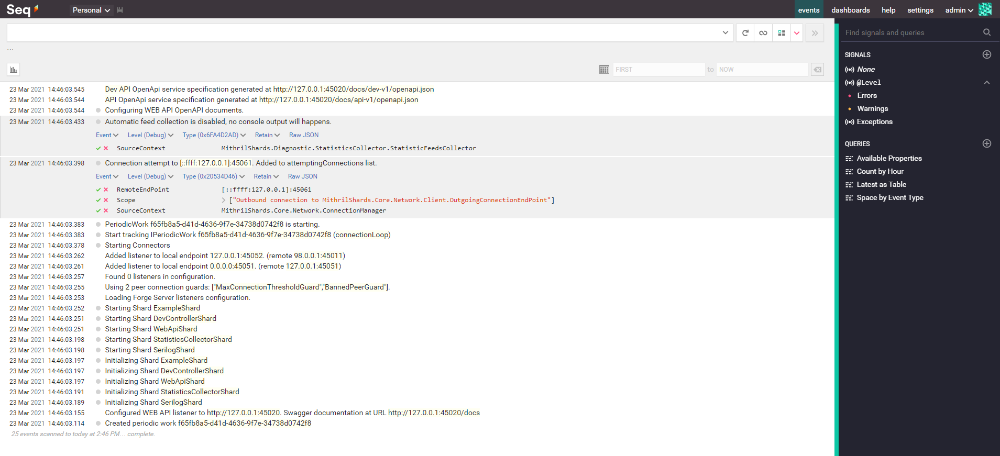

--8<-- "refs.txt"

SerilogShard allows to inject [Serilog]{:target="_blank"} log provider into the forge, allowing every service to leverage it to produce a proper loggin implementation for the application.

It can be injected into the forge just by using the IForgeBuilder extension

```c#
public static IForgeBuilder UseSerilog(this IForgeBuilder forgeBuilder, string? configurationFile = null)
```

`configurationFile` is optional, and can contain the path of a JSON configuration file, refers to Serilog documentation to see how to configure it properly.

If no `configurationFile` is specified, the forge configuration file is used.

!!! note
	Using an explicit configuration file allows to have more control over the configuration files used during debug and deploy, because allows you to have a file for application configuration, and a different set of configuration files specific for logging, where you can pre-configure a set of filters based on your needs

An example of a configuration section is this:

```json
{
   "Serilog": {
      "Using": [ "Serilog.Sinks.Console", "Serilog.Sinks.Seq" ],
      "Enrich": [ "FromLogContext", "WithMachineName", "WithThreadId" ],
      "WriteTo": [
         {
            "Name": "Console",
            "Args": {
               "IncludeScopes": true,
               "theme": "Serilog.Sinks.SystemConsole.Themes.AnsiConsoleTheme::Code, Serilog.Sinks.Console"
            }
         },
         {
            "Name": "Seq",
            "Args": { "serverUrl": "http://localhost:5341" }
         }
      ],
      "MinimumLevel": {
         "Default": "Debug",
         "Override": {
            "Bedrock.Framework": "Warning",
            "Microsoft": "Warning",
            "System": "Warning"
         }
      }
   }
}
```

In this example we are defining two serilog sinks: [console](#console-sink) and [seq sink](seq-sink).

`MinimulLevel` section allows to configure the filter based on logging severity level, in this case the default level is Debug and we have a couple of override to rise the level to warning for all classes belonging to namespace *Bedrok.Framework*, *Microsoft* and *System*

Tweaking these settings is important to reduce the noise of unwanted logs of 3rd party libraries and focus our attention on logs that matter to us.

### Console Sink

Console configure the logger to use console output and in the `WriteTo` section we specify to include scopes and use a theme to colorize the output.

An output example is this

{.zoom}

### Seq Sink

[Seq](https://datalust.co/seq){:target="_blank"}  is an interesting web application that can be configured to receive logs generated by Serilog, it has a free plan for single user and in my case it was a good choice for development purpose because I can host it in my local environment and leverage its feature to be able to investigate problems. It can be both installed locally or be hosted in a docker container.

In the example above it has been configured to receive logs on port 5341

```json
{
   "Name": "Seq",
   "Args": { "serverUrl": "http://localhost:5341" }
}
```

It shares the same MinimumLevel section to configure which logs will be persisted but can have dynamic overrides.

Seq allows you to query, create filters, signals and show structured logs in a friendly way, for further information refers to Seq website.

An example of Seq interface with a couple of expanded logs, to show you additional information you can found in these logs

{.zoom}

