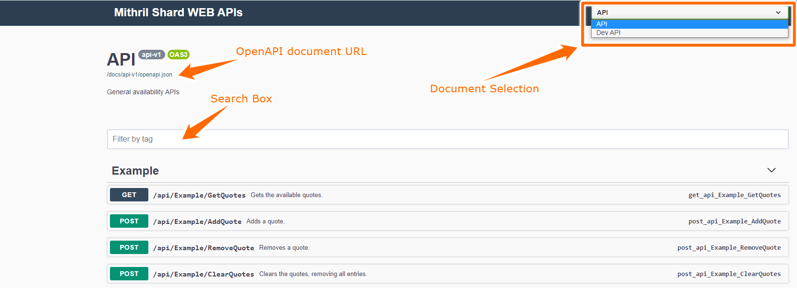
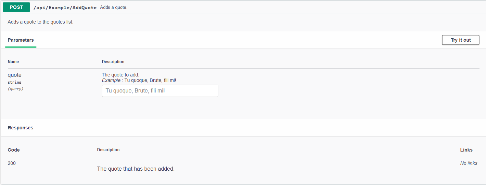

--8<-- "refs.txt"

[Swagger UI](https://swagger.io/tools/swagger-ui/){:target="_blank"} allows to visualize and interact with the Web API resources generated from OpenAPI toolset.  
WebApiShard makes use of it and thus we can have a nice UI to test and document our API.

As stated in [ApiServiceDefinition] section, each area generates a different OpenAPI document and we can use tool like Swagger UI to convert that specification to turn that document into an UI that allows us to test and read documentation about our exposed API resources.

An OpenAPI document can even be used by tools like [AutoRest](https://github.com/Azure/autorest){:target="_blank"} to generate automatically clients (in different programming languages) for RESTful API!

!!! note
	Mithril Shards customizes a bit the look of Swagger UI but it will be familiar to who is already used to work with it.

The address to access swagger UI depends on [WebApiSettings] `EndPoint` parameter.

If we consider the default EndPoint `127.0.0.1:45020`, a WebApiShard enabled application exposes Swagger at the url 


## Swagger UI Elements

Without going too deeper into documenting the UI (there are a lot of resources on the web about [Swagger UI](https://swagger.io/tools/swagger-ui/){:target="_blank"} and anyway it's pretty straightforward) I want to highlight a couple of sections

{.zoom}

### Document Selection  

It's a combo box that allows you to select one of the [ApiServiceDefinition] defined area that are currently enabled.
In this example we have selected API that corresponds to our `WebApiArea.API` (or simply "api") area defined by WebApiShard itself.  
You can see another option, DEV API, that corresponds to the `WebApiArea.DEV` (or simply "dev") area defined by [DevControllerShard].

!!! note
  	The displayed name corresponds to ApiServiceDefinition `Name` property.

### OpenAPI document URL

It's the URL of the selected OpenAPI document.  
It can be used to generate RESTful clients with tools like [AutoRest](https://github.com/Azure/autorest){:target="_blank"}.

### Search Box

Allows to filter Web API resources by their name or description.

## Performing an API request

By clicking on an API entry, it's possible to execute it by clicking on `Try it out` button, filling the required data (in this example the field `quote`) and then pressing the "Execute" button that will be displayed



!!! note
	It is possible to provide examples and more documentation by using C# XML comments, you can find more information in the section [Include Descriptions](https://github.com/domaindrivendev/Swashbuckle.AspNetCore#include-descriptions-from-xml-comments){:target="_blank"} from XML Comments on Swashbuckle.AspNetCore repository or by looking at the `ExampleController` source code in the MithrilShards.Example.Dev project.

The screenshot above shows the `AddQuote` action in the [example project] and it has been fully documented:

```c#
/// <summary>
/// Adds a quote.
/// </summary>
/// <param name="quote" example="Tu quoque, Brute, fili mi!">The quote to add.</param>
/// <response code="200">The quote that has been added.</response>
/// <remarks>
/// Adds a quote to the quotes list.
/// </remarks>
[HttpPost]
[ProducesResponseType(StatusCodes.Status200OK)]
public ActionResult AddQuote(string quote)
{
   _quoteService.Quotes.Add(quote);

   _logger.LogDebug("A new quote has been added: `{Quote}`", quote);

   return Ok(quote);
}
```

